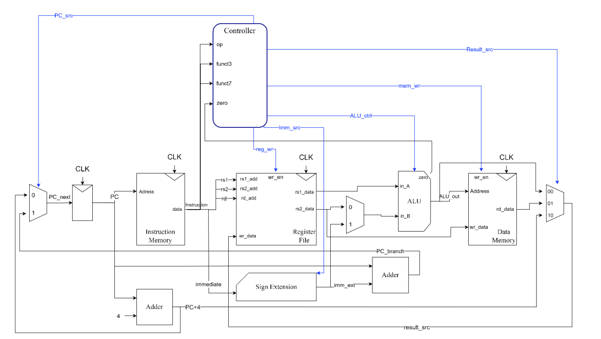

# RISC_V
Basic single cycle RISC-V CPU implementation in Verilog.

### The following subset of RV32I instruction set is implemented:
* `R-Type:` - **add, sub, and, or** 
* `I-Type:` - **addi, andi, ori, lw, jalr** 
* `B-Type:` - **beq, bne** 
* `J-Type:` - **jal** 
* `S-Type:` - **sw** 

### Block diagram:

